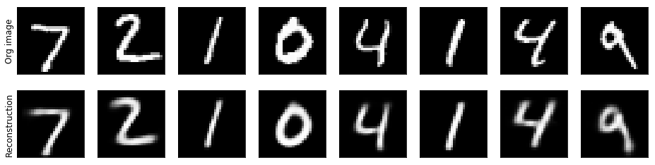
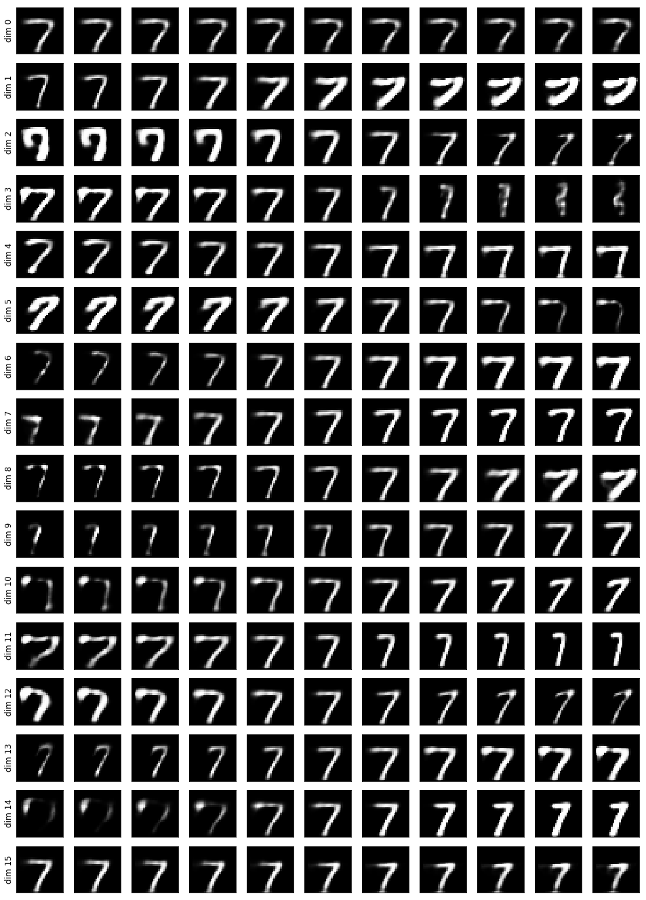

# Dynamic Routing Between Capsules - PyTorch implementation

PyTorch implementation of NIPS 2017 paper [Dynamic Routing Between Capsules](https://arxiv.org/abs/1710.09829) from Sara Sabour, Nicholas Frosst and Geoffrey E. Hinton.

The hyperparameters and data augmentation strategy strictly follow the paper.

## Requirements

Only [PyTorch](http://pytorch.org/) with torchvision is required (tested on pytorch 0.2.0). Jupyter and matplotlib is required to run the notebook with visualizations.

## Usage

Train the model by running

    python net.py
Optional arguments and default values:

```
  --batch-size N          input batch size for training (default: 128)
  --test-batch-size N     input batch size for testing (default: 1000)
  --epochs N              number of epochs to train (default: 250)
  --lr LR                 learning rate (default: 0.001)
  --no-cuda               disables CUDA training
  --seed S                random seed (default: 1)
  --log-interval N        how many batches to wait before logging training
                          status (default: 10)
  --routing_iterations    number of iterations for routing algorithm (default: 3)
  --with_reconstruction   should reconstruction layers be used
```

MNIST dataset will be downloaded automatically.

## Results

The network trained with reconstruction and 3 routing iterations on MNIST dataset achieves **99.65%** accuracy on test set. The test loss is still slightly decreasing, so the accuracy could probably be improved with more training and more careful learning rate schedule.

## Visualizations

We can visualize visualizations of digit reconstructions from DigitCaps (e.g. Figure 3 in the paper)




We can also visualize what each dimension of digit capsule represents (Section 5.1, Figure 4 in the paper). 

Below, each row shows the reconstruction when one of the 16 dimensions in the DigitCaps representation is tweaked by intervals of 0.05 in the range [−0.25, 0.25].



We can see what individual dimensions represent for digit 7,  e.g. dim6 - stroke thickness, dim11 - digit width, dim 15 - vertical shift.

Visualization examples are provided in a [jupyter notebook](reconstruction_visualization.ipynb)